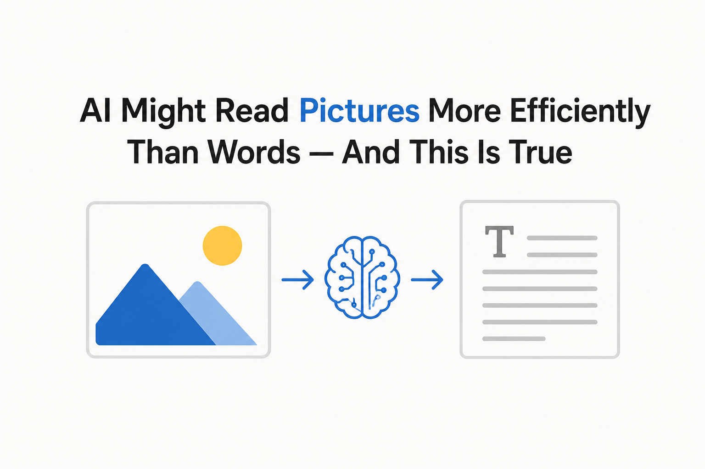
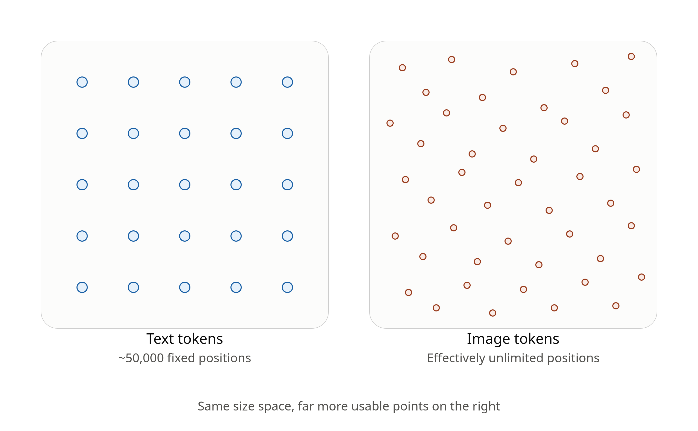
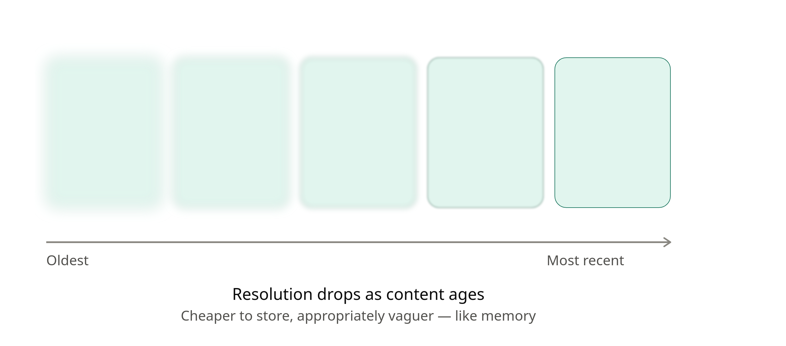

A few weeks ago, DeepSeek released an OCR paper with a strange and interesting claim buried inside it: you can hand an AI model a *picture* of a page of text, and it can pack ten times more information into its memory than if you'd given it the text itself, character by character.

Same words, same meaning — but ten times cheaper to store and process.

If that sounds backwards, you're not alone. Most people assume text is the "efficient" format and images are the "heavy" one. A text file is a few kilobytes; a screenshot of that same file is a few hundred kilobytes. So how could an image possibly be the more compact option once it's inside an AI model?

## How AI models actually see text

When you type a sentence into ChatGPT or Claude, the model doesn't read your words directly. It first breaks your sentence into "tokens" — word fragments — and looks each one up in a fixed dictionary of about 50,000 entries. Every token in that dictionary corresponds to one specific slot in the model's memory.

That's the key detail: it's a *fixed* dictionary. There are only 50,000 possible text tokens, and every one you use has to be one of those 50,000, no more, no less.

Images don't work that way. A model doesn't look up an image in a dictionary of pre-approved picture-tokens — it can't, because there's no way to list every possible arrangement of pixels in advance. Instead, an image gets converted into a location in a much larger, continuous space, one that can represent an effectively unlimited number of subtly different possibilities.

So it's less "images are naturally richer" and more "text tokens are boxed into 50,000 pigeonholes, while image tokens can land anywhere in a vastly bigger field." That extra room is where the tenfold efficiency comes from — an image token can encode much finer distinctions than a text token ever could, simply because it isn't restricted to a short pre-set list.

## What this could mean in practice

If this pans out, it opens up a genuinely useful trick: instead of pasting a long block of text into an AI chatbot, you could take a screenshot of it and upload the image instead. The model would, in theory, be able to "read" the same content while using a fraction of the memory it would otherwise need — which could mean AI systems that hold onto much longer conversations or documents without running out of room, packing more information into the same amount of space rather than processing it any quicker.

The DeepSeek paper takes this a step further with an idea that resembles human memory: as a conversation grows longer, older parts of it could be stored as lower-resolution, "blurrier" images — cheaper to keep around, and appropriately vaguer, the same way your memory of a conversation last month is fuzzier than one from this morning. In practice, that means older parts of a conversation get quietly downgraded to blurrier, cheaper-to-store images, while the most recent exchange stays sharp — a sliding scale of detail rather than an all-or-nothing memory.

## The catch

Before you get too excited, it's worth being honest about the gap here. What the DeepSeek paper actually demonstrates is that a model can *read back* text from a compressed image almost perfectly — that's an OCR task, essentially a very sophisticated form of copying. It hasn't been shown that a model can *reason*, *summarize*, or *write* using text-as-image just as well as it can with ordinary text. Recognizing what a passage says and actually thinking about it are two different skills, and only the first one has been proven to work well this way so far.

It's also unclear how you'd train a brand-new AI model from scratch using this method, rather than just applying it to an already-trained model. Teaching a model to predict "the next word" is straightforward with text. Teaching it to predict "the next chunk of an image" is a much messier problem, and it's not obvious yet how to do it without ending up back at something that's basically a normal language model in disguise.

So the honest summary is: this is a real and promising result, not a gimmick — but it's a proof of concept for compression and retrieval, not yet proof that AI models can *think* just as well when reading pictures of words instead of the words themselves. Whether that gap closes is one of the more interesting open questions in AI right now.

---

**Credits:** Based on a discussion by [ThePrimeTime](https://www.youtube.com/@ThePrimeTimeagen), with reference to Sean Goedecke's original post, [Should LLMs Just Treat Text Content as an Image?](https://www.seangoedecke.com/text-tokens-as-image-tokens/). Written with the help of Claude (Anthropic).
