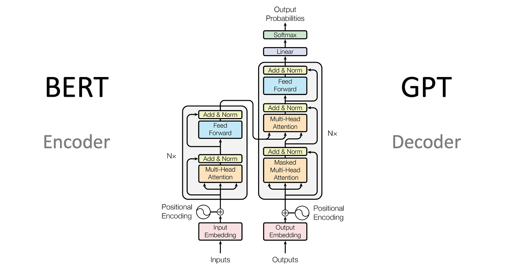
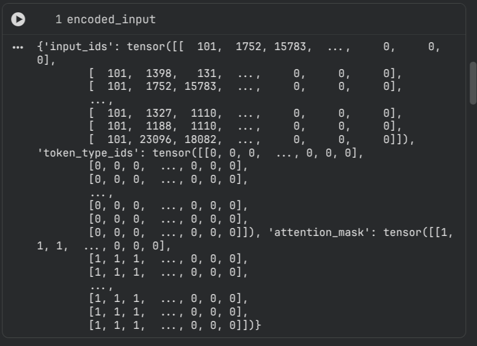
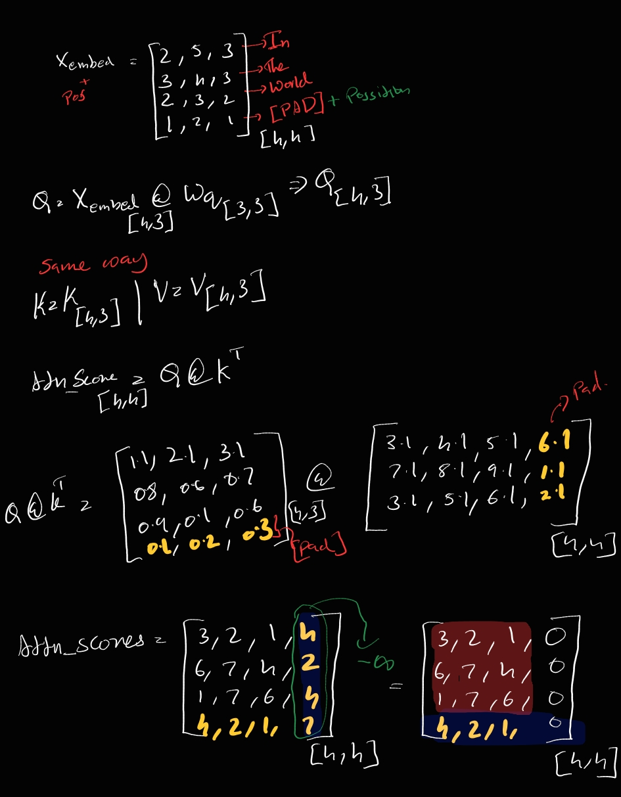
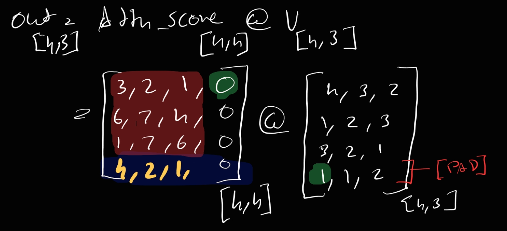

## Why this Write ?
So I read the whole BERT paper, which was my first white-paper reading session. I used Sreedath Panat sir's reading session to gain confidence. The confidence I gained ended with questions when I completed reading. The immediate next thing I did was to find solutions for my questions in a way that should satisfy my intuitivity. Most of the questions got solved and were easy with a web search.

But the [PAD] Token stayed back with questions <) the need for this special token, how we use it in Multi-Head Attention with multiple matrix multiplications which can ruin the whole semantics and contextuality. On top of that, we don’t use [PAD] during inference time (all whys will be answered). Also, we don’t train [PAD] embeddings, thus during backprop the gradients won’t flow back.

Spoiler Alert: All my questions came down to a little cute concept of masking a particular part in the attention block (we will dissect it). For now, that’s enough as an intro with some good spoilers — now let’s get into the “Art of Dissecting.”

 _BIG NOTE_ : This is not a write-up on training BERT or fine-tuning it. This blog is about a math concept that excites and confused me.   

Before we Start, Let's say _CHROOT BERT_.

## Why [PAD] Token?
Will explain with a small example.
We have 2 sentence embedding matrices, each has an embed dim of 12 but differ in total token counts.

Let’s say the first sentence is [8,12] and the second is a [5,12] vector.

Yes, in a naive way it’s possible to train, but it’s more time consuming and inefficient. It’s like sending one by one through a pipeline.

But do you know where we train our models? Yes, it’s on a GPU (with tensor cores), so to make it go brrrr we need to make this input to the model more parallel processing friendly. It’s impossible to stack uneven matrices together, that’s when we bring in the CARD of [PAD].

Boooo... but what will [PAD] do to make the GPU go brrr?... it does the most fancy thing by adding [PAD] token embeddings on all other spaces where data is empty.

In the case of our example, if 8 is the max length then the first matrix stays the same, but the second one adds 3 additional PAD embeddings to make it [8,12] (8 = 5 already existing + 3 [PAD-embed] to fill the vacuum).

Eventually, when we batch for training the shape after embedding with 2 in batch will look like [2, 8, 12].

#### One major thing to add is that the token embedding vector of [PAD] will be all zeros, which won’t be learned in the future. 


## What about [PAD]s attending attention Block?

So the Attention Block is the part where tokens interact with each other, so every token will have an idea of where they stand in the sequence while respecting the context.
This is done using unmasked Multi-Head Attention, which inside carries trainable weights.

The right side of the below picture is a Decoder model which is built on unmasked attention.


-> How unmasked attention looks in code
```py
from torch import nn

class Multi_Head_Padding_UnMasked_Attention(nn.Module):
  def __init__(self,
               hidden_size,
               num_heads):
    super().__init__()

    assert hidden_size % num_heads == 0

    self.hidden_size = hidden_size
    self.num_heads = num_heads
    self.head_dim = hidden_size // num_heads

    self.qkv_proj = nn.Linear(hidden_size, 3 * hidden_size)
    self.out_proj = nn.Linear(hidden_size, hidden_size)

  def forward(self, x, attention_mask=None):
    B, T, C  = x.shape

    qkv = self.qkv_proj(x)
    q, k, v = qkv.chunk(3, dim = -1)

    q = q.view(B, T, self.num_heads, self.head_dim).transpose(1,2)
    k = k.view(B, T, self.num_heads, self.head_dim).transpose(1,2)
    v = v.view(B, T, self.num_heads, self.head_dim).transpose(1,2)

    attn_scores = (q @ k.transpose(-2, -1)) / math.sqrt(self.head_dim)
    if attention_mask is not None:
      attn_scores = attn_scores.masked_fill(attention_mask == 0, -1e9)
 
    attn_wights = torch.softmax(attn_scores, dim=-1)
    out = attn_wights @ v
    out = out.transpose(1,2).contiguous().view(B, T, C)

    return self.out_proj(out) , attn_scores
```

The code might look confusing, so let’s go deep.
You can see an attention mask inside the forward function. It’s basically a binary vector showing which tokens are [PAD] in an input. If [PAD] tokens are present, then the `attention_mask`
will carry 0 for those positions. 

attention_mask is returned by tokenizer with token encoding.
-> Given Example import of tokenizer and attention mask output.
(Complete code availabel on github link given bellow)
```py
from transformers import BertTokenizer
encoded_input = tokenizer(
    sentences,
    padding='max_length',   # or True / False
    truncation=True,
    max_length=MAX_LENGTH,
    return_tensors='pt',
    return_attention_mask=True,
    return_token_type_ids=True
)
```


Also in BERT we use a encoder model which uses a Un-Masked MHA which means the future tokens can also influence the attention_scores unlike self attention models.

So lets move to our next phase,
## The Problem ?

As we have a [PAD] token embedding, there is a chance that it can influence other tokens in the sequence, which is morally incorrect because the intention of [PAD] is just to fill up the vacuum, not to influence the context.

Even though the embedding vector of [PAD] is all zeros, there can be added positional embeddings or segment embeddings or something else added to it, which makes the accumulated embedding not zero.

The embedding being zero or not doesn’t matter to us. The problem only arises when attention weights get matmul’ed with the V vector inside attention block.

Now Let's illustrate whats happning inside Trasformer for BERT.



* The -inf part is where we apply softmax and also the out from softmax will sum to 1 not as in he picture, but the above image will give an idea on whats happnning inside. 

By now, with the code and the image, you guys will be able to guess where we are heading.
We are taking the attention mask value returned by the tokenizer and applying -inf to all values in the specified column. It will be a row-wise operation (the same mask is taken to each row to find the 0 and change the value in the [PAD] position and convert it to -inf).

Why -inf can be a question? 
Its because e^-inf is 0, also because of this it wont be contributing in attention weights.


#### I can hear you all.

### Why only zeroing colums and not rows?
* The simple answer is that it will create a division by zero error during softmax.
* The broader answer would be: “We don’t care about what [PAD] is or what its outputs are, we aren’t going to run backprop on it.”

* _The best way to think about it is that the layers we add on top work independently on tokens, not as an attention mechanism. So treat every token as an individual, and we don’t train on [PAD]._ 

### What about zeroing colums but still we have a Value Matrix waiting to get multiplied so won't that affect?

Simple answer N000000.
But will go bit deap because out intution won't get easily satisfied. _I Know That_



-> Let's just take the first row from attn_score and first col from Value Matrics. 
-> Now look at those green markings.
-> Now just try to matmul just this part you will see that the contribution from [PAD] pos is just zero.
That's what we want.

But now what about last row or [PAD] row in attn_score. 
_Boss look at the question above this._

### So what about Backprop and [PAD]s, how do we make them stay away from learning?
```py
loss_fn = nn.CrossEntropyLoss(ignore_index=-100)
```
While creating labels we make sure the labels of [PAD] shold be -100.
I dont think it's required if the trianing is only on [CLS] Token.

Btw, why I call UnMasked attenion model is because it's A encoder only model, unlike a Decoder model it can attend to all token. Decoder only model has Self-attention, like in GPT it will Force the model to not learn from future tokens.But in our case the mask for only [PAD] token that to only to improve eficincy. If not we don't need that aswell.
##### We Go For Brrr, So We Need It.

One last thing,
-> Max length isn MAX else truncate it.

Thank you for Reading My Blog. 
Currenty I don't have a comment section, im working on it until then you can email me your comment d[dtg@soluto.in](mailto:dtg@soluto.in) .

Colab repo of Mock Training I did.
You can visualise how attn_score while training in this notebook.
[Colab Link](https://colab.research.google.com/drive/1njBWtRecInQCzd5Cod2OeIGiNlpmrofw?usp=sharing)
