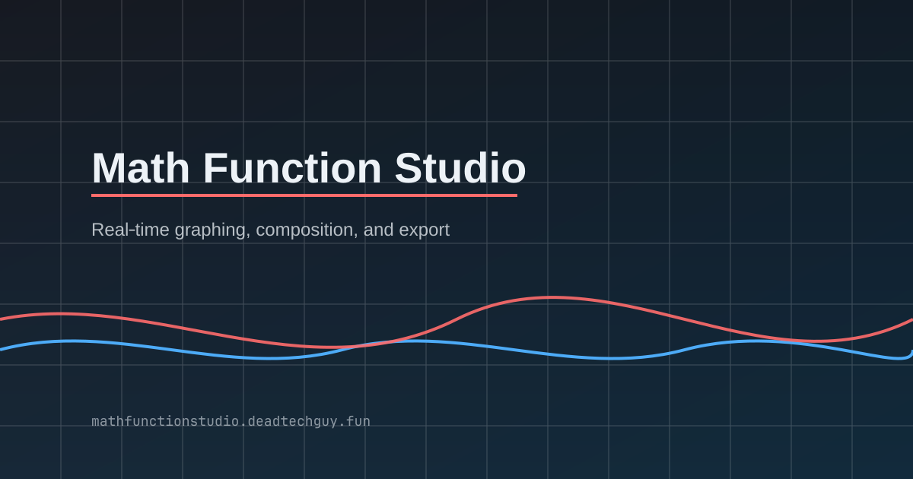

## Why I Built It
I wanted a math graphing tool that feels instant, flexible, and a bit more “maker‑friendly” than the heavyweight options. Something where I can sketch ideas, compose functions, and export a clean visual without fighting the UI.

## What It Does
Math Function Studio lets you define multiple named functions, combine them, and visualize the output in real time.

- Plot custom expressions with trig, logs, exponentials, and roots.
- Compose, add, and multiply functions with one click.
- Overlay numeric derivative and integral curves.
- Show discontinuities and asymptotes.
- Export to PNG or SVG for clean sharing.

Live site: https://mathfunctionstudio.deadtechguy.fun/

## How It Works (Short Version)
This project uses a custom expression parser and evaluator (no external math libraries) so expressions are flexible and fast. The graph is drawn on a canvas with a responsive viewport, drag + zoom controls, and a few helper tools like axis labels and hover readouts.

## Design Decisions I Like
- **Immediate feedback**: type in the expression, the graph updates with zero friction.
- **Composability**: `f(x) + g(x)` and `f(g(x))` are first‑class features.
- **Export ready**: clean exports with labels, equations, and a watermark.

## Tech Stack
- React 18
- Vite 5
- Custom math parser + AST evaluator
- Canvas rendering

## What’s Next
I’m keeping this one focused and fast, but I want to add:
- Better domain analysis for `log`, `sqrt`, and trig functions.
- Symbolic simplification for exact discontinuities.
- More export layouts and annotations.

If you try it, send me your feedback.
