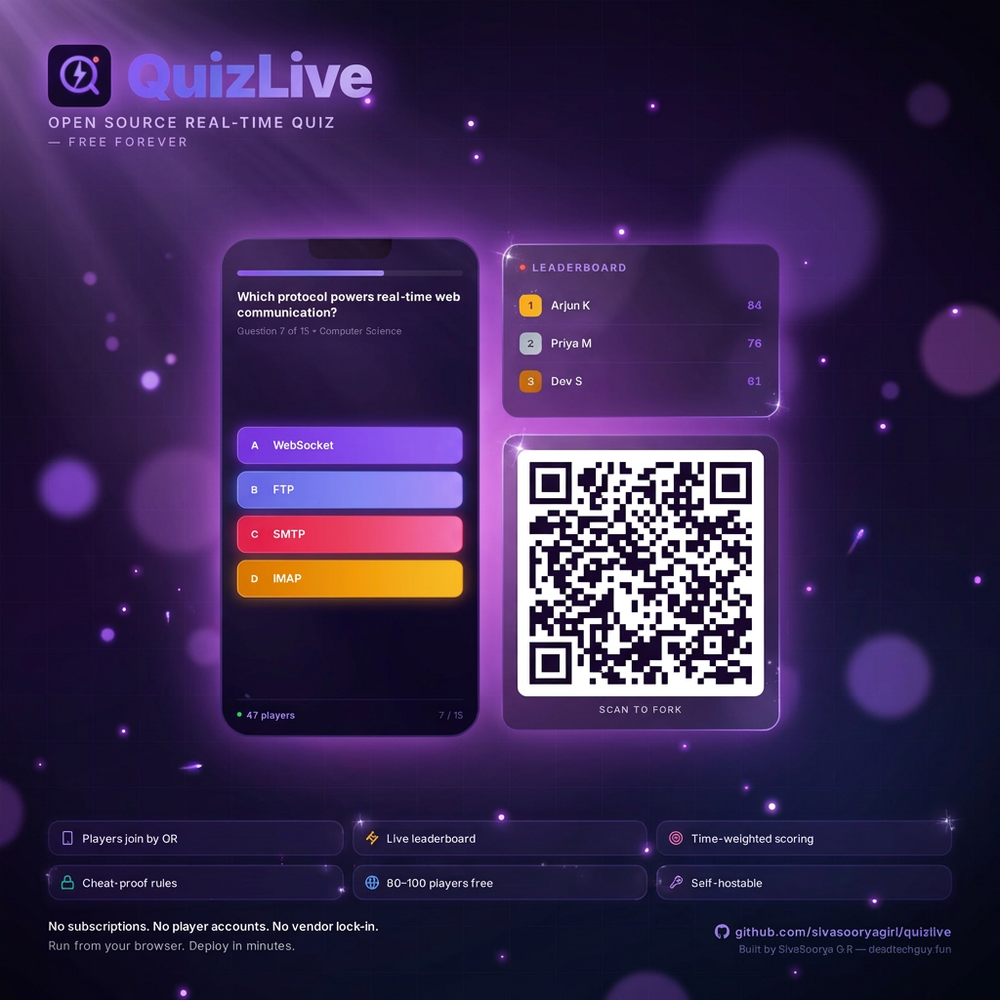
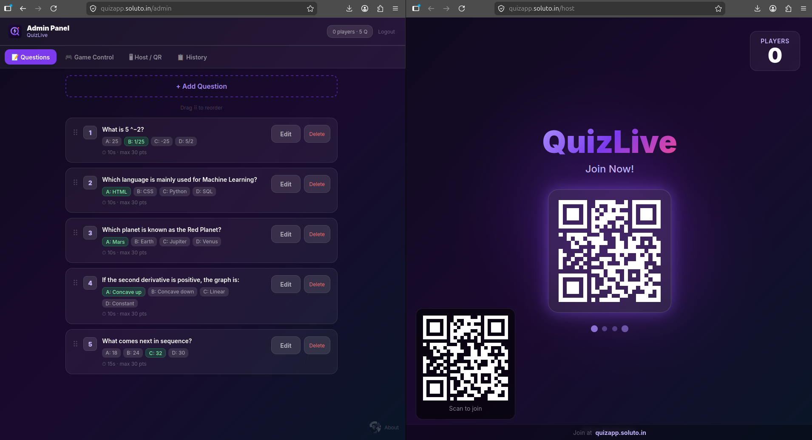
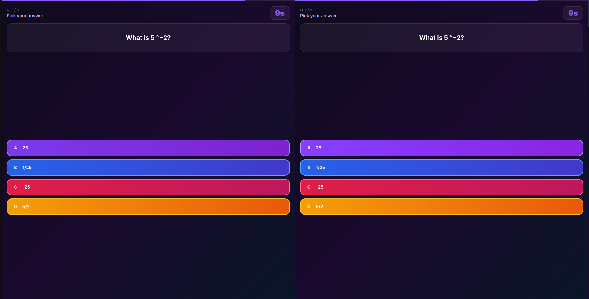
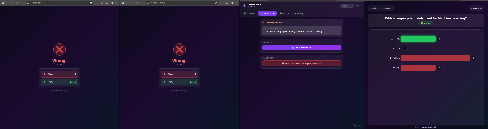
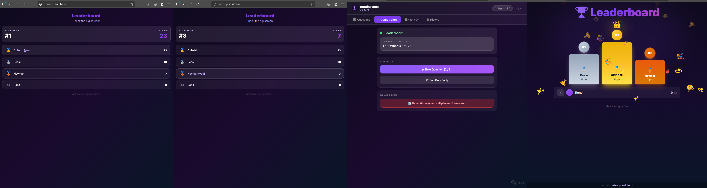
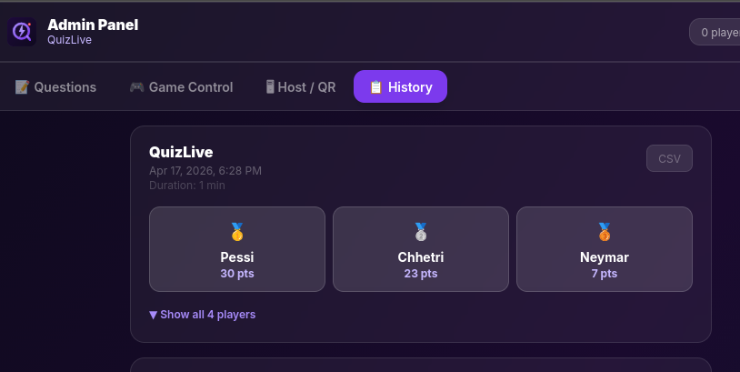

## Why I Built It

Every time I wanted to run a quiz — classroom, team event, trivia night — I kept hitting the same wall. Kahoot wants $17/month. Slido wants $15/month. Both store your data on their servers. The moment you stop paying, your questions, your sessions, your leaderboard history — gone.

I wanted something I actually own. Something that deploys for free, doesn't lock me into a vendor, and keeps every session I've ever run in my own database. So I built QuizLive.

GitHub: https://github.com/sivasooryagiri/quizlive

---

## What It Does

Players join from their phones — scan a QR code or visit a URL, no account needed. A host screen runs on the projector showing a live answer bar chart, countdown timer, and podium leaderboard. An admin panel controls everything: create questions, start the game, advance rounds, view session history, export results as CSV.



The free Firebase tier covers **~80–100 concurrent players at $0/month**. You own every line of code and the entire database.

---

## The Stack

- **React 18 + Vite** — fast builds, lazy-loaded routes for admin and host so player phones don't download the whole app just to answer a question
- **Firebase Firestore** — all state lives here, real-time `onSnapshot` listeners push updates across every connected client instantly
- **Firebase Authentication** — admin login only, no player accounts needed
- **Tailwind CSS + Framer Motion** — styling and animations
- **Recharts** — live answer bar chart on the host screen during questions
- **qrcode.react** — QR join code on the projector screen

---

## How the Real-Time Sync Works

Everything flows through a single Firestore database:

```
meta/gameState     → phase, currentQuestionIndex, questionStartTime
questions/{id}     → text, options[], timer, order
answerKeys/{id}    → correctAnswer (hidden during question phase)
players/{id}       → name (scores are never stored here)
answers/{qId_pId}  → answer, timeTaken, timer (no isCorrect, no score)
sessions/{id}      → final leaderboard snapshot
```

The game runs as a state machine through `meta/gameState`. When admin taps "Start Quiz", the phase flips to `'question'` and `questionStartTime` is stamped with a Firebase server timestamp. Every connected client — player phones, the projector, the admin — has an `onSnapshot` listener and reacts the moment the phase changes.

When the admin advances to results, scoring happens client-side: joins answer docs with the now-readable answer keys, runs `calcScore()` per player, sorts by total. That's what shows on phones and the projector. No backend functions, no server beyond Firestore rules.

---

## The Security Model

### Hidden Answer Keys

Classic cheat: open DevTools, read the network response, get the correct answer before submitting.

The correct answer isn't in the question document. It lives in `/answerKeys/{questionId}`, locked by Firestore rules during the question phase. Players cannot read it while a question is active — rejected server-side, no matter what the client does. After the phase flips to `'results'`, the key becomes readable — by which point everyone already submitted.

### Blind Answer Writes

A subtler attack: submit with `isCorrect: true`, see if it's accepted, probe to find the right answer.

The Firestore rule **forbids `isCorrect` and `score` fields entirely** on answer writes. Any write containing either is rejected outright. Nothing to probe.

```js
allow create: if
  gameState.phase == 'question' &&
  request.resource.data.answer >= 0 &&
  request.resource.data.answer <= 3 &&
  !('isCorrect' in request.resource.data) &&
  !('score' in request.resource.data);
```

Scores are computed at read time only — after the question phase ends — by joining answers with the now-readable answer keys. No mutable score field anywhere to tamper with.



---

## The Scoring Formula

```
score = 0                                               if answer is wrong
score = max(5, round(30 - (timeTaken / timer) * 25))   if answer is correct
```

| When you answer | Points |
|---|---|
| Instantly | 30 |
| Half the timer | ~18 |
| Last second | 5 |
| Wrong / no answer | 0 |

Floor of 5 means a slow-but-correct answer always beats a wrong one. Linear decay because "faster = more points" is something you can explain to a room of people in two seconds.

Ranking uses standard competition ranking — 1-2-2-4, same as FIFA. Ties share a rank, next rank skips. Two players tied for first both get gold medals on the podium.



---

## The Leaderboard



When players tie, the rank circle above each podium slot shows the real tie-aware rank. The medal comes from actual rank — so two gold medals can appear. The slot you stand on is arbitrary. The number above your head is real.

---

## Session History



Every session is saved automatically when the quiz ends. The history tab shows past leaderboards, and any session downloads as CSV. The export neutralizes Excel formula injection — cells starting with `= + - @` get prefixed with `'` so they render as text, not formulas.

---

## Deploying It — Firebase + Vercel

**Step 1 — Firebase (5 minutes)**

1. [console.firebase.google.com](https://console.firebase.google.com) → Create a project
2. Firestore Database → Create → Production mode → pick a region
3. Authentication → Email/Password → Enable → Add user → email: `admin@quizlive.internal` + your password
4. Project Settings → Your Apps → Web → copy the `firebaseConfig` values
5. Paste `firestore.rules` from the repo into Firestore → Rules → Publish

**Step 2 — Vercel (1 click)**

Hit the Deploy button in the README. Vercel clones the repo to your GitHub, asks for your Firebase config as env vars, and deploys automatically. You get a live URL in minutes. Set `VITE_JOIN_URL` to that URL so the QR code points at the right place, then redeploy once.

Done. Firebase Spark (free) + Vercel Hobby (free) = **$0**.

---

## Cost

| Usage | Monthly cost |
|---|---|
| Classroom (30 students, 15 Q, daily) | **$0** — free tier |
| 100 players × 3 sessions/day × 30 Q | ~$1–2 |
| 1,000 players × 5 sessions/day × 30 Q | ~$15–20 |

The free Firebase Spark tier gives 50,000 reads/day, 20,000 writes/day, 100 concurrent connections. A typical classroom session uses ~3,000 reads and ~300 writes. Most people never pay a cent. Any cost goes straight to your own Google project — QuizLive takes nothing.

---

## What I Learned — Prompting AI to Build Something You Own

This whole project was built with **Claude Code** using Sonnet 4.6 and Opus 4.7.

The biggest thing I kept thinking while building this: there are so many tools out there where you pay but own nothing. Kahoot owns your quiz data. Slido owns your session history. You're renting a product — and the moment you stop paying, your questions, your history, your leaderboards are gone. Export is limited, self-hosting is impossible, customization is off the table.

With AI-assisted development, that equation flips. You build it yourself, you own it completely. QuizLive's session history lives in your Firebase project — your Firestore database, your data. You can export it as CSV, query it directly from the console, or hook into it however you want. Nothing disappears because nothing is rented.

That's the actual learning: the barrier to building something you fully own has basically disappeared. You just need to know how to explain what you want.

**On prompting Claude specifically:**

Be specific about constraints upfront — "compute scores at read time, never store isCorrect on the answer doc" gives a completely different architecture than just "add scoring." Explain the why, not just the what — Claude designs better when it understands the intent behind the request. One problem at a time, always. And read what it writes, especially security rules — confident output doesn't mean correct output.

---

## What's Next

- Presentation themes — dark, light, branded, selectable per session
- Room mood / word cloud — players type a word, it floats on the host screen as a bubble
- Image questions, team mode, bulk question import, webhooks on session end

Fork it, run it, break it. Bugs to [dtg@soluto.in](mailto:dtg@soluto.in).

*(This project page was written by Claude using Claude Code — Claude Sonnet 4.6 and Opus 4.7)*
